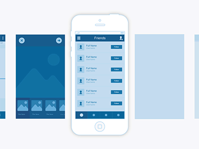
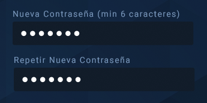
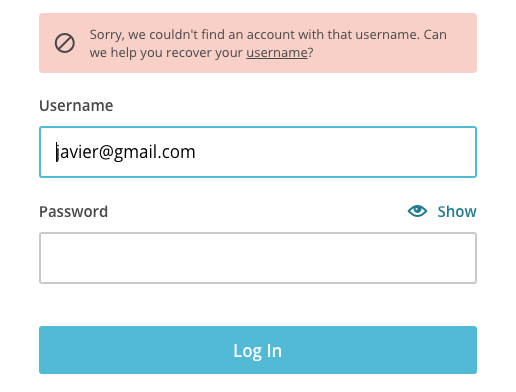

# Heuristicas de usabilidad {docsify-ignore-all}

[Jakob Nielsen](https://es.wikipedia.org/wiki/Jakob_Nielsen), el “maestro de la usabilidad” creo [10 reglas](https://www.nngroup.com/articles/ten-usability-heuristics/) para identificar los posibles problemas de usabilidad a través del estudio de 249 problemas.

Las 10 reglas generales para el diseño de interacción. Se les llama “heurísticas”, ya que se explican más como normas generales que como directrices de usabilidad específicas.

## 1 Visibilidad del estado del sistema

El sistema siempre debe mantener informados a los usuarios de lo que está ocurriendo, mediante una respuesta de información y dentro de un tiempo razonable.

## 2 Relación entre el sistema y el mundo real

El sistema debe hablar el lenguaje de los usuarios mediante palabras, frases y conceptos que sean familiares al usuario, más que con términos relacionados con el propio sistema. Seguir las convenciones del mundo real, haciendo que la información aparezca en un orden natural y lógico.

## 3 Control y libertad del usuario

Hay ocasiones en que los usuarios elegirán las funciones del sistema por error y necesitarán una “salida de emergencia” claramente marcada para salir del estado no deseado al que accedieron y sin tener que pasar por una serie de pasos engorrosos. Se deben clarificar las posibilidades de deshacer y rehacer.

## 4 Consistencia y estándares

Los usuarios no deben cuestionarse si acciones, situaciones o palabras diferentes significan en realidad la misma cosa; sigue las convenciones establecidas.

## 5 Prevención de errores

Mucho mejor que un buen diseño de mensajes de error es realizar un diseño cuidadoso que prevengan los problemas. Antes de ejecutar una acción solicite al usuario una confirmación, como por ejemplo cancelar compra, o salir sin guardar los cambios realizados en el documento.

## 6 Reconocimiento antes que recuerdo

Minimiza lo que le pidas memorizar al usuario. Se deben hacer visibles las acciones y las opciones posibles. El usuario no tendría que recordar la información que se le da en una parte del proceso, para poder seguir adelante. Las instrucciones para el uso del sistema deben estar a la vista o estar siempre disponibles cuando sean necesarias.

## 7 Flexibilidad y eficiencia de uso

La presencia de atajos, que no son vistos por los usuarios novatos, pueden ofrecer una interacción más rápida a los usuarios avanzados. Esta interacción es más eficaz que la que el sistema puede proveer a los usuarios de todo tipo. Se debe permitir que los usuarios adapten el sistema para usos frecuentes. Como por ejemplo los atajos del teclado mediante combinación de teclas.

## 8 Estética y diseño minimalista

Los diálogos no deben contener información que es irrelevante o poco utilizada. Cada unidad extra de información en un diálogo, compite con las unidades de información relevante y disminuye su visibilidad relativa.

## 9 Ayudar a los usuarios a reconocer, diagnosticar y recuperarse de los errores

Los mensajes de error se deben mostrar en un lenguaje claro y simple, indicando en forma precisa el problema y sugiriendo una solución constructiva al problema.

## 10 Ayuda y documentación

Incluso en el mejor de los casos en donde el sistema puede ser usado sin tutoriales, podría ser igualmente necesario ofrecer ayuda y documentación. Dicha información debería ser fácil de encontrar, estar pensada para el usuario, y debe tener una lista concreta de pasos a seguir sin ser demasiado extensa.

