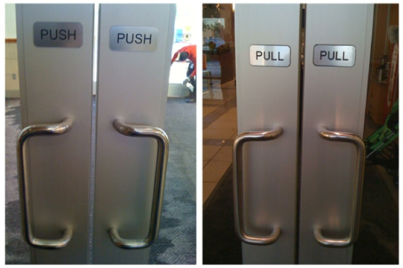
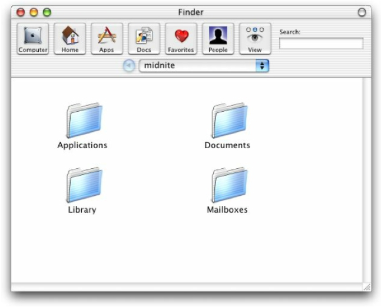

## Principios Fundamentales de la Interacción {docsify-ignore-all}

Cuando interactuamos con un producto, debemos descubrir cómo hacerlo. Esto significa descubrir qué hace, cómo funciona y qué operaciones son posibles: “descubribilidad” (discoverability). La “descubribilidad” es el resultado de la aplicación apropiada de seis conceptos psicológicos:

* Affordances (Ofrecimientos)
* Signifiers (Significantes)
* Constraints (Restricciones)
* Mappings (Mapeos)
* Feedback (Retroalimentación)
* Conceptual Model (Modelo Conceptual)

### Affordances (Ofrecimientos)

Es la relación entre las propiedades del objeto y las capacidades del usuario de comprender cómo es posible usarlo. No es una propiedad, es una
relación y depende tanto de las propiedades del objeto como de la comprensión del usuario.

### Signifiers (Significantes)

Los ofrecimientos determinan qué acciones son posibles y dónde esas acciones se llevan a cabo. Los usuarios suelen buscar pistas que brinden sentido y los diseñadores deben ser capaces de proveerlas.
Lo que los usuarios necesitan y los diseñadores proveen, son los significantes.

### Constraints (Restricciones)

Con el uso apropiado de las restricciones limitamos a un número de acciones posibles (o al menos deseadas). Las restricciones deben ser:

  * Útiles
  * Fáciles de ver e interpreter
  * Permitir hacer algo que antes no se podía
  * También previenen de errores o acciones no deseadas

### Mappings (Mapeos)

Los mejores mapeos son aquellos en donde la relación entre los controles y el objeto a ser controlado se vuelve obvia. Idealmente los mapeos deberían ser claros y sin ambigüedades

### Feedback (Retroalimentación)

El feedback es la comunicación del resultado de una acción. Debe ser inmediato. Aún un pequeño delay puede ser desconcertante.

### Conceptual Model (Modelo Conceptual)

Un modelo conceptual es una representación (usualmente muy simplificada) del objeto que buscamos explicar. Los documentos, las carpetas, los íconos de un SO ayudan a crear un modelo conceptual de cómo se organizan los archivos y directorios dentro de la computadora.

