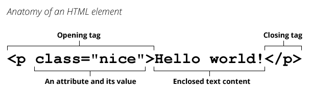

# 2.3 Los tags en HTML {docsify-ignore-all}



**HTML** funciona principalmente tomando un contenido, y "haciendo un sándwich" alrededor de él con un tag de apertura y un tag de cierre. Los tags de apertura (opening tag) y de cierre (closing tag) están encerrados entre los símbolos ```< >``` y son iguales, con la única diferencia que el tag de cierre empieza con un símbolo /. El contenido que quede encerrado entre el opening tag y el closing tag es lo que se va a ver en la página, tomando diferentes formas según el tag que lo envuelva.
