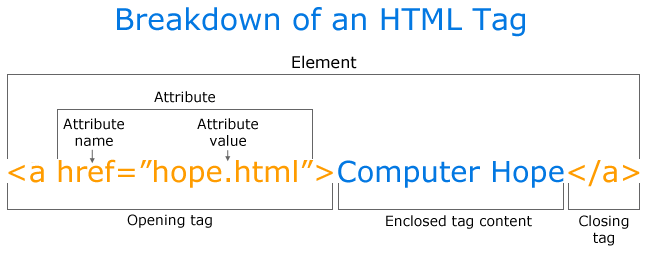

# 4.2 El tag < a > {docsify-ignore-all}

En el ejemplo de arriba, el primer caso corresponde a un tag `<a>`, llamado "anchor tag" y que se usa para crear links.
Veamos su anatomía:

Se compone de un tag de apertura `<a>` y un tag de cierre `</a>` que delimitan donde empieza y donde termina el tag.

El opening y closing tag envuelven al texto "Computer Hope", transformándolo en un link visible por el ususario.

El atributo **href** dentro del opening tag (donde siempre van los atributos) se usa para indicar la dirección a donde deberá llevar el link cuando el usuario haga click. En este caso el valor es "hope.html" que es una página html dentro del sistema local de quien creo el link.

El **href** puede linkear tanto a páginas locales dentro de sus compus como a páginas externas en internet:

En el caso de los archivos locales tienen que escribir el nombre y extensión ("ejemplo.html") del archivo si está en la misma carpeta que la página que tiene el link, o la ruta hacia el archivo de destino si está en otro directorio ("paginas/clase1/pagina.html").

En el caso de linkear a una página externa, el valor del atributo tiene que incluir el `"https://"`. Por ejemplo para linkear a Google el valor de href debería ser: `<a href="https://www.google.com"> texto que va a linkear a google </a>`.
