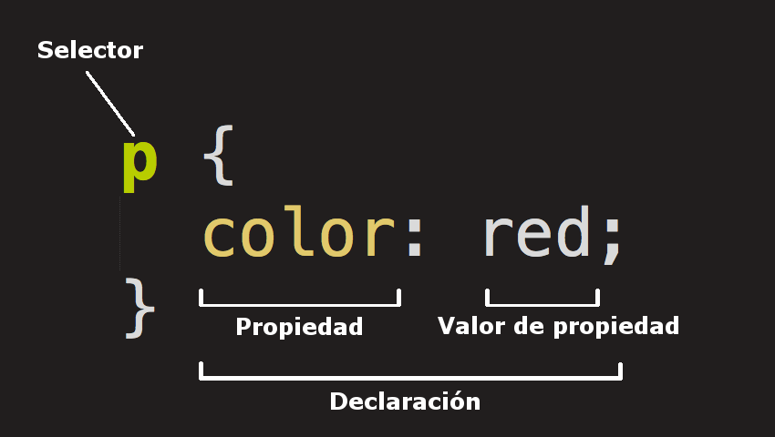

# Cómo escribir CSS {docsify-ignore-all}

La sintaxis básica de **CSS** se compone de la siguiente manera:

Un selector, es decir un comando que selecciona uno o más elementos del documento **HTML**, por ejemplo el `<body>`, los `<p>`, etc.

Al selector le siguen llaves { } que contienen los estilos (cambios estéticos) que queremos darle a los elementos seleccionados.

Dentro de las llaves se escribe una propiedad **css** que queremos modificar (el color, el tamaño de la letra, etc) y un valor para esa propiedad, separados por dos puntos (:)

Pueden enumerarse muchas propiedades a modificar al mismo tiempo, separándolas con un punto y coma (;)

El código se ve de esta forma:

```css
selector {
  propiedad: valor;
  otraPropiedad: valor;
}
```



Todo el código CSS que escribamos va a seguir esta estructura. Veamos algunos ejemplos:

```css
h1 {
  font-family: verdana;
}
```

El ejemplo de arriba selecciona todos los elementos h1 del documento, y les cambia el font-family (la tipografía) a verdana.

```css
p {
  color: green; 
  background-color: yellow;
}
```

El ejemplo de arriba selecciona todos los elementos p del documento, y les cambia el color al valor green (la propiedad color refiere al color de la letra) y el fondo a amarillo.

```css
em {
  font-size: 300%;
}
```

El ejemplo de arriba selecciona todos los elementos em del documento (recuerden que era el tag inline que usabamos para envolver una parte del texto y hacerla italica), y les cambia el atributo font-size al valor 300%, es decir que ahora además de poner al texto que contiene en itálica va a aumentarle el tamaño de la letra.

Podemos poner muchas reglas seguidas, escribiendo cada una en una línea nueva. En el caso de arriba sería:

```css
h1 {
  font-family: verdana;
}
p {
color: green; 
background-color: yellow;
}
em {
font-size: 300%;
}
```

Notá que estos ejemplos usan selectores de elementos HTML genéricos (h1, p, em), es decir que seleccionan todos los elementos h1, todos los párrafos y todos los em, y los modifican. Más adelante veremos otros selectores más específicos, para seleccionar elementos HTML individuales, por ejemplo un párrafo en particular, o un h1 puntual del documento. No te pongas ansios@ ;)

Una nota sobre las propiedades css: Hay muchísimas propiedades css que se pueden modificar, acá hay una [lista](https://developer.mozilla.org/en-US/docs/Web/CSS/Reference) ridículamente exhaustiva por si quieren investigar. No se asusten, por ahora vamos a limitarnos a las propiedades más comunes que se usan todo el tiempo, pero si quieren probar algo nuevo ahí tienen para divertirse :)

>[!Tip|style:flat|label:Tip]
>Sabés que podes usar la consola de Chrome para aplicar estilos, aprendé como hacerlo en este sitio: [Chrome Dev Tools](https://developers.google.com/web/tools/chrome-devtools/css/)
