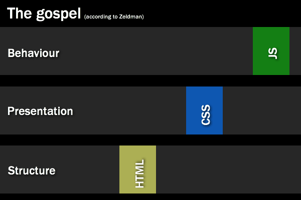
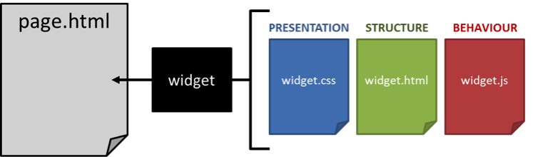

# Separación de Tareas {docsify-ignore-all}

Como ya mencionamos, un concepto clave en el desarrollo **Front End** (programación de todo lo que interactúa con el usuario) es el de **"separation of concerns"**. Básicamente significa que cuando hacemos un sitio, cada lenguaje tiene un rol y sus respectivos códigos deberían estar en archivos separados (pero vinculados, como acabamos de hacer con el tag link para unir un html y un css). Estas imágenes lo resumen bien (no se preocupen por la parte de JavaScript, ya vamos a llegar):

En la práctica los archivos quedan separados, pero vinculados entre sí, y muestran el resultado final deseado (page.html) cuando el usuario accede a la página.

