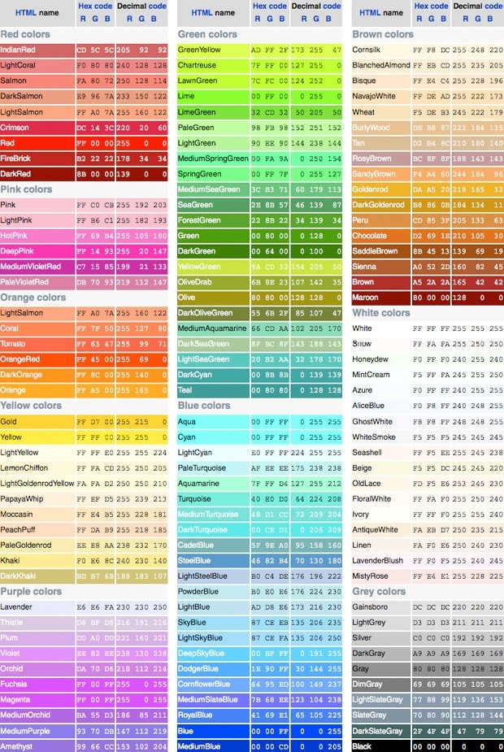

# Colores en CSS {docsify-ignore-all}

CSS nos permite escribir los colores de tres maneras diferentes indistintamente:

* Con su nombre en inglés. Ej. red, green, blue, purple
* Con su [código hexadecimal](https://es.wikipedia.org/wiki/Sistema_hexadecimal), una secuencia de 6 dígitos entre 0 y F precedidos por un signo '#'. Ej.#CD00CD (magenta)
* Con RGB (red, green, blue), dándole un valor entre 0 y 255 a cada uno de los tres colores. Ej. rgb(210, 140, 176).

Entonces, escribir "background-color: lime;", "background-color: #00FF00;" o "background-color: rgb(0,255,0);" daría el mismo resultado, un fondo color lima. 

Esto es muy útil porque los diseñadores nunca les van a pasar el nombre de un color, sino que les van a dar un tono específico en hexa o en rgb.

Estos dos recursos están muy buenos para buscar colores:

* La página [coolors.co](https://coolors.co/)

* Esta lista de colores con sus códigos hex y rgb:

>[!TIP|style:flat|label:RGBA]
>Existe un cuarto formato que es el de rgba, que es igual a RGB pero con un cuarto valor entre 0 y 1 que refiere a la transparencia del color. >Entonces por ejemplo rgba(0, 255, 0, 0.5) genera un color lime pero con un tono más transparente.
