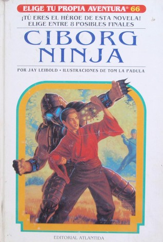

# PROYECTO: Elige tu propia aventura {docsify-ignore-all}

¿Te acordás de estos libros? (si no te acordás sos muy jóven…) ¡Hagamos una versión online para revivir este éxito editorial!

Por si no te acordás cómo era la mecánica de estos libros (es entendible, pasó mucho tiempo) o nunca los viste (deberías buscar uno, con excelentes), en cada página te describía una situación de la aventura y te daba dos opciones para decidir qué hacer. Según qué opción elegías te llevaba a distintas páginas con nuevas situaciones hasta que llegabas a un punto en que ganabas o perdías la aventura (generalmente con una muerte horrorosa).

Hagamos una versión online:
Vas a tener que crear sólamente dos "templates" (plantillas estándar) html que se reutilizarán todo el tiempo:

Una página para las instancias en las que el usuario enfrenta una situación y tiene que decidir qué hacer.
Una página para las instancias en que la aventura termina.

>[!TIP|style:flat|label:Sugerencia]
>Para las páginas de situación podés pones una imagen, un texto y dos botones con las opciones que linkeen a otras situaciones o finales. Si te gusta más otra estructura sentite libre de crear algo diferente, de eso se trata todo esto :)

Acordate que para darle estilos a las páginas vas a necesitar un archivo css externo. Desde ese archivo controlás toda la estética del sitio.

Una vez que tenés los dos templates creados sólo tenés que copiarlos y pegarlos varias veces y cambiarles el contenido, creando distintas situaciones y distintos finales.

Por último, lo único que te queda es vincular las páginas entre sí, haciendo que cada opción te lleve a una página distinta.

Cuando lo termines subilo a [Netlify Drop](https://www.bitballoon.com/) y compartilo :D
