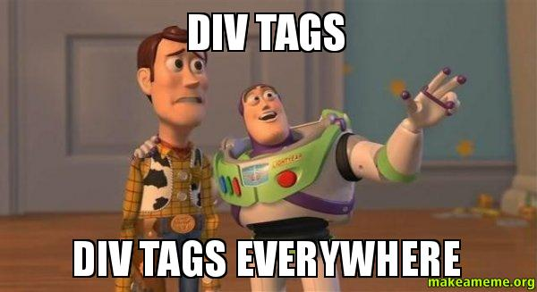

# ¿Qué son? {docsify-ignore-all}

Los tags `
` y `` son contenedores vacíos que nos sirven para agrupar secciones de contenido dentro de nuestra página. Imagínenlos como cajas de vidrio que sirven para rodear distintas partes de nuestra página, definiéndolas como secciones que después podemos modificar usando CSS.

La diferencia entre div y span es que div es de tipo block, osea que ocupa todo el ancho de la pantalla y desplaza a los elementos que no estén contenidos dentro suyo hacia arriba y abajo, y span es de tipo inline, es decir que ocupa sólo el espacio de su contenido y sirve por ejemplo para seleccionar partes específicas de un documento, como una frase en un párrafo o una palabra.
