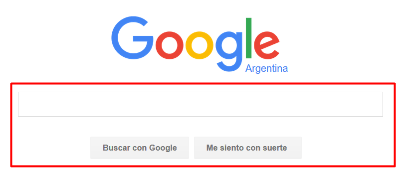
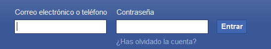
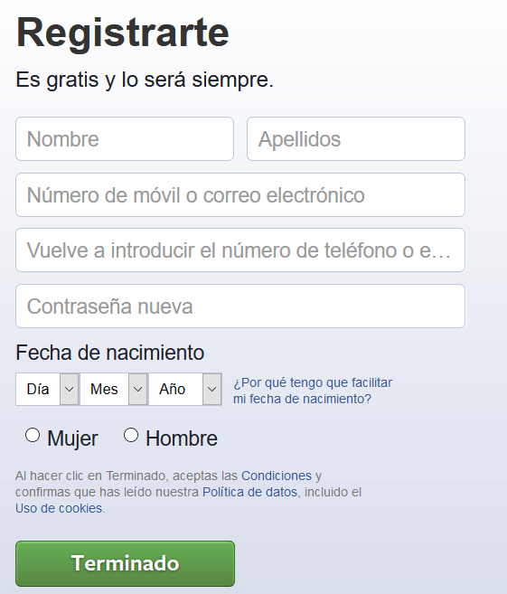

# Recibiendo Input del Usuario {docsify-ignore-all}

Los formularios HTML se usan para recorger información que nos da el usuario y están por todos lados en internet. Algunos ejemplos que seguro viste:

El elemento `<form>` define el comienzo y el fin de un formulario HTML. Dentro de él van tags `<input>` que crean campos donde el usuario ingresa información (los tags `<input>` son autocontenidos, osea que no hace falta cerrarlos, a diferencia de form que se abre y se cierra normalmente). 

Los tags `<input>` tienen el atributo type que define el tipo de ese input. Por ejemplo, poner type="text" define un campo donde el usuario puede escribir cualquier texto. Poner type="email" en cambio hace que sea obligatorio escribir un mail. El type=submit genera un botón que envía la información del formulario. Hay muchos [tipos de inputs](https://www.w3schools.com/tags/att_input_type.asp), pero vamos a usar sólo los más comunes.
