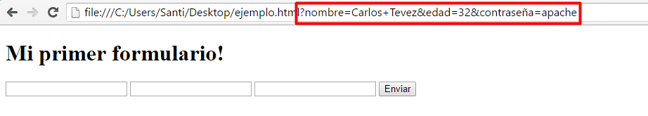

# Creando un Formulario {docsify-ignore-all}

```html
<form>
  <input type="text">
  <input type="password">
  <input type="email">
  <input type="submit">
</form>
```

>[!TIP|style:flat|label:Importante]
>Los tags `<input>` pueden ponerse por separado en el html fuera de un tag form, pero si queremos que toda la información que ingresa el usuario esté relacionada y se envíe junta tiene que estar contenida dentro de un tag `<input>`. Por otro lado, el tag form es un un elemento block, por lo que empuja a los demás elementos arriba y abajo, mientras que los inputs son inline. Al ser inline, los inputs van a quedar uno al lado del otro, pero si querés ponerlos uno debajo del otro podés poner un tag `<br>` (no se cierra, va asi solo) después de cada input, que genera un salto de línea.

El tag form tiene dos atributos principales, action y method. action define a dónde (url o carpeta dentro de un servidor) debe mandar la data del formulario. El atributo method define qué método HTTP usará: "get" si pide información, o "post" si envía información. Por ahora vamos a dejar ambos campos vacíos.

Cuando apretamos submit, el formulario envía la data que ingresó el usuario en forma de key-value pairs, es decir una variable con el contenido de cada input. Por ejemplo, si queremos mandar la edad de una persona, el servidor debería recibir un campo "edad" y un valor numérico con la edad que ingresó el usuario en el input. Para indicar el nombre del campo de un input debemos usar el atributo name dentro del input. Cada input debería tener su atributo name especificando a qué campo corresponde esa información. El siguiente código enviaría un campo con el nombre del usuario, otro con su edad y otro con su contraseña:

```html
<form>
  <input type="text" name="nombre">
  <input type="number" name="edad">
  <input type="password" name="contraseña">
  <input type="submit">
</form>
```

Probalo vos mismo: pegá el código de arriba en un nuevo documento html, completalo y apretá submit.

¿Notás algún cambio? Si te fijas en la url vas a ver que ahora contiene un signo `?` seguido por la información de cada campo que ingresaste, separados por un signo `&`. Este formato se llama query string, y es un bloque de texto sin espacios que se usa para enviar información (el espacio se reemplaza por `%20`, asi como otros símbolos como los acentos tienen sus propias formas de escribirse en este formato).



Noten que si bien cuando escribimos en el campo con type password el texto aparece oculto, cuando hacemos submit la data se envía sin encriptar como podemos ver con la contraseña de carlitos en el ejemplo de arriba. Es por esto que cuando se configuran contraseñas se usan sistemas más complejos del lado del servidor para mantener segura la información. Esto por ahora nos sirve sólo para la experiencia del usuario, haciendo que la gente que pasa no pueda leer la contraseña que está escribiendo.
