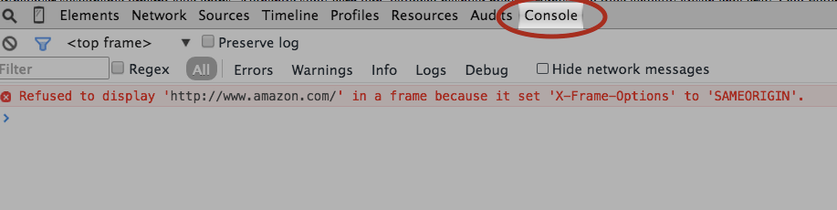

# Ejercicio: Iframes {docsify-ignore-all}

Entrá a un mapa de [Google](https://www.google.com.ar/maps/place/Tuvalu/@-7.4783777,178.6624144,14z/data=!3m1!4b1!4m5!3m4!1s0x6fc19cb959b1a04d:0x8f6754680707122e!8m2!3d-7.4784206!4d178.679924) y apretá la opción "compartir" (o "share" si está en inglés).

Te va a aparecer una ventana con una pestaña que dice "compartir vínculo" y otra que dice "incorporar mapa", elegí esa opción.
Copiá el tag `<iframe>` que te dan y pegalo en tu documento html.
Hacé lo mismo con un video de Youtube (compartir…) y agregalo a tu html.

Buscá en la [documentación de mozilla](https://developer.mozilla.org/en-US/docs/Web/HTML/Element) cómo agregarle un borde al iframe y hacelo con los dos anteriores. Intentá una de tus páginas favoritas con un nuevo iframe. 

Si no se muestra, abrí la consola dentro de las herramientas de desarrollador de Chrome *Crtl+Shift+J* y mirá si hay algún error como este: `"Refused to display"`. Si aparece es porque el sitio no permite que lo muestren en iframes.

