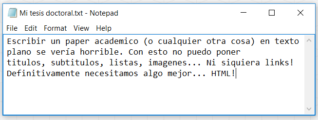

# 2.2 Historia de HTML {docsify-ignore-all}

**HTML** fue creado a fines de la década de 1980/principios de los 90. En esa época internet se usaba principalmente con fines académicos, para enviar papers y documentos técnicos, pero desafortunadamente sólo se podía enviar texto plano (sin formato). El problema con esto era que no permitía que los textos tuvieran un orden claro, ni permitía linkearlos a otros trabajos, algo fundamental para las citas en los trabajos académicos. Supongamos que tenemos que mandar una tesis usando sólo texto plano:

Eso es exactamente lo que nos permite hacer **HTML**: nos deja tomar texto y contenido de un documento y darle forma usando "**tags**". Estos tags son piezas de código que envuelven distintas partes del documento y le indican al navegador cómo debe mostrarlas. Por ejemplo, puede indicarle que una parte del texto es un título, que otra parte es un link a otro sitio, que esto va en itálica, que aquello va en negrita, etc. Esto nos permite darle un formato complejo a un documento.

Este lenguaje resultó tan útil que en poco tiempo fue tomado por gente no académica y terminó volviéndose un estándar de internet, particularmente porque podía ser usado por gente sin un background muy técnico gracias a su relativa simpleza.
