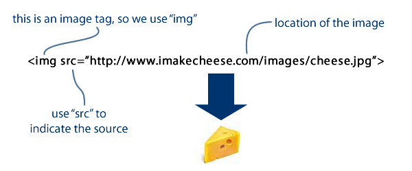

# 4.2 El tag < img > {docsify-ignore-all}

El tag img que vemos arriba también tiene un atributo, que en este caso se llama **src** e indica el lugar donde se aloja la imagen que se debe mostrar, pero vemos que tiene algo diferente a los ejemplos anteriores: no tiene closing tag ( `</img>` ). Algunos tags se componen sólo de un opening tag, ya que no están envolviendo nada. El tag **img** indica al browser que ahí debe ir una imagen y con el atributo **src** le dice dónde tiene que ir a buscar esa imagen.
